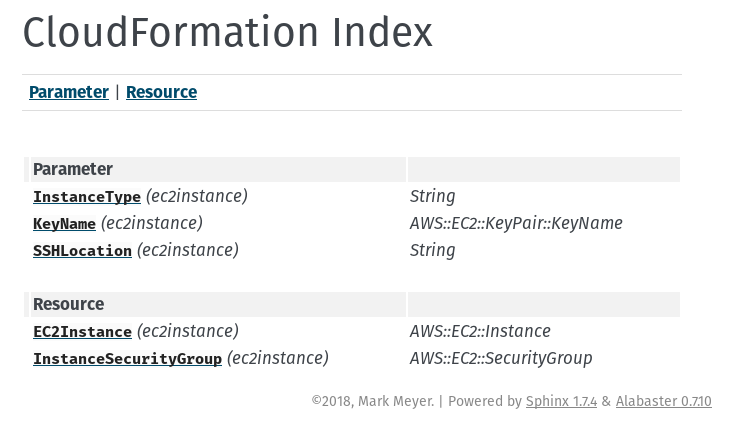

# Sphinx for CloudFormation

This is the Sphinx for CloudFormation extension.

See https://github.com/ofosos/cfn-doctemplate for a template to apply
this.

Example index:



## Development

This is developed on Python 3.

For dev install via:

```
pip install json pyyaml docutils sphinx
pip install .
```

## Contributors

Mark Meyer <mark@ofosos.org>
